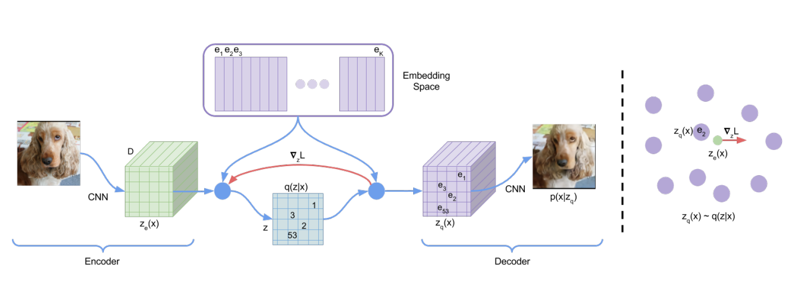

# Neural Discrete Representation Learning (VQVAE)

This repo is my pytorch implementation of the paper, [Neural Discrete Representation Learning](https://arxiv.org/pdf/1711.00937.pdf). 
The original source code make my the authors was using pytorch and can be found [here](https://github.com/deepmind/sonnet/blob/v2/sonnet/src/nets/vqvae.py). 

## Dependencies

This project was made using [Pipenv](https://github.com/pypa/pipenv) for keeping track of dependencies. First you must have Pipenv installed:
```
pip install pipenv
```
After having Pipenv installed, you should create a virutalenv for the project. To do this, cd into the directory and run the command:
```
pipenv shell
```
Finally, to install the necessary dependencies run:
```
pipenv install
```

## Running

All that is needed to run the code is to launch the jupyter notebook and change out the [Food101](https://data.vision.ee.ethz.ch/cvl/datasets_extra/food-101/) dataset with your own.

## Models

There are 3 components to the VQ-VAE model:
1. Encoder
2. Vector Quantizer
3. Decoder

I tried my best to re-create the encoder and decoder from the paper, but there may be some differences. The purpose of the encoder is to compress the image to a smaller latent space while retaining as much knowledge about the original image as possible. Then we use the vector quantizer, the main focus of this paper, to take the output vectors from the encoder and try to match each of those vectors to an embedding, also called a codebook, that closely matches it. We then take this quantized encoder output and feed it into the decoder to try and reconstruct the image.


Credit: https://arxiv.org/pdf/1711.00937.pdf

## Future Improvements

There are a few improvements and implementations that could still be added to this project to better the reconstruction. One thing that could definately be improved is my implementation of the encoder and decoder models. It sppears that right now they might not be extracting enough information for a higher quality reconstruction. Another way to protentially improve reconstruction would be to either increase the embedding dimensions or amount of embeddings. 

This repo in its current state is only setup for image reconstruction and the PixelCNN has not been implemented for image generation.